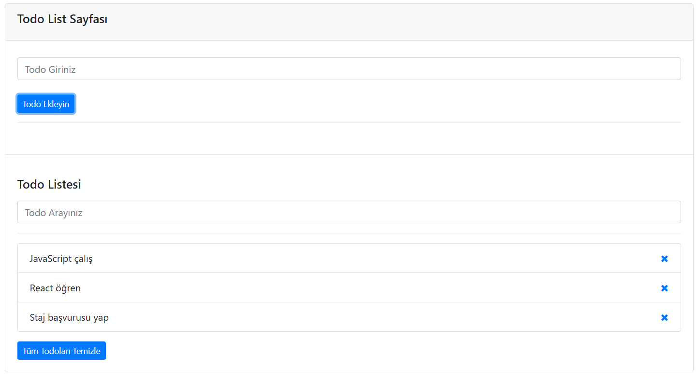

# 📝 Todo List App

A simple Todo List application built with **JavaScript**, **Bootstrap**, and **LocalStorage**.

This project allows users to add, delete, filter and store todos in the browser.

---

## 🚀 Features

* ➕ Add new todos
* ❌ Delete individual todos
* 🧹 Clear all todos
* 🔍 Filter todos by typing
* 💾 Save todos using **LocalStorage**
* 🔄 Todos remain after page refresh

---

## 🛠 Technologies Used

* **HTML5**
* **Bootstrap 4**
* **JavaScript (DOM Manipulation)**
* **LocalStorage**

---

## 📷 Project Screenshot

(Add a screenshot of the project here)

Example:



---

## 📂 Project Structure

```
todo-list-app
│
├── index.html
├── app.js
└── README.md
```

---

## 🎯 Purpose of the Project

This project was built to practice:

* DOM Manipulation
* Event Handling
* LocalStorage usage
* Basic JavaScript project structure

---

## 💻 How to Run

1. Download or clone the repository
2. Open **index.html** in your browser

---

## 👨‍💻 Author

Developed by **Fehmi Can Günay**
